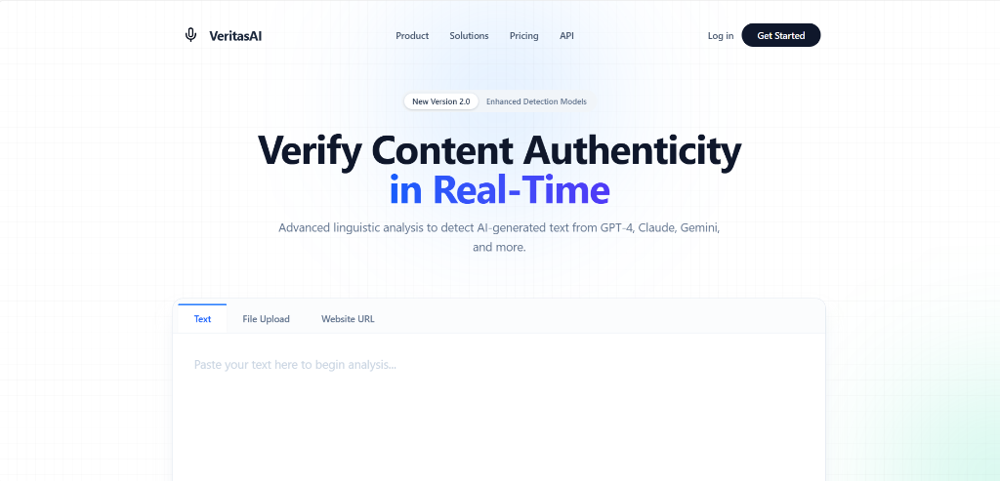

<div align="center">

# VeritasAI
### Advanced AI Content Detection System

[](https://opensource.org/licenses/MIT)


> **"Verify Content Authenticity in Real-Time."**
>
> A professional, multi-layered AI detection system capable of identifying text generated by GPT-4, Claude, Gemini, and other LLMs.

[Overview](#-overview) • [Features](#-key-features) • [Architecture](#-system-architecture) • [API](#-api-documentation) • [Installation](#-installation-guide)

</div>

---

## 🚀 Overview

**VeritasAI** is a full-stack web application designed to help users distinguish between human-written and AI-generated text. Unlike simple classifiers, VeritasAI employs a robust **Tri-Layer Analysis Engine**:

1.  **Statistical Analysis**: Calculates _Perplexity_ and _Burstiness_ to detect the "uniformity" typical of AI.
2.  **Linguistic Patterns**: Analyzes sentence structure, readability scores (ARI), and vocabulary richness.
3.  **Deep Learning Model**: Utilizes a fine-tuned Transformer model (RoBERTa/GPT-2) for semantic classification.

<div align="center">
  
</div>

---

## ✨ Key Features

| Feature | Description |
| :--- | :--- |
| **Real-Time Analysis** | Instant probability scoring with sub-second latency. |
| **Deep Metrics** | Visual gauges for "Burstiness", "Perplexity", and more. |
| **Modern UI/UX** | Glassmorphism-based design using React 19 & Tailwind CSS 4. |
| **PDF Reports** | Generate professional verification certificates instantly. |
| **Privacy First** | No data is stored; all analysis happens in-memory. |

---

## � Project Structure

A high-level overview of the codebase organization.

```text
VeritasAI/
├── backend/                 # Python FastAPI Server
│   ├── main.py              # Application Entry Point
│   ├── requirements.txt     # Python Dependencies
│   └── venv/                # Virtual Environment (Generated)
│
├── frontend/                # React Application
│   ├── src/
│   │   ├── App.tsx          # Main Component
│   │   ├── components/      # UI Components (Header, Input, etc.)
│   │   └── index.css        # Tailwind & Global Styles
│   ├── package.json         # Node Dependencies
│   └── vite.config.ts       # Build Configuration
│
├── assets/                  # Static Images (Banner, Screenshot)
├── start_all.bat            # One-click startup script (Windows)
└── README.md                # Documentation
```

---

## 🏗 System Architecture

The system operates on a client-server architecture designed for modularity and speed.

### The Tri-Layer Engine (Backend)
When text is submitted, it passes through three distinct analysis pipelines:

1.  **Metric Engine (`scipy`, `nltk`)**:
    *   **Perplexity**: Measures how "surprised" a model is by the text. Low perplexity = likely AI.
    *   **Burstiness**: Measures variation in sentence structure. Low burstiness = likely AI.

2.  **Linguistic Engine (`spaCy`)**:
    *   Parses syntax trees to find repetitive sentence structures and lack of vocabulary diversity commonly found in LLM outputs.

3.  **Transformer Engine (`torch`, `transformers`)**:
    *   Passes tokenized text through a pre-trained RoBERTa model finetuned for detection.
    *   Outputs a raw probability logit which is normalized to a 0-100% score.

---

## 📡 API Documentation

The Backend exposes a RESTful API powered by FastAPI.

### `POST /predict`
Analyzes the provided text and returns detection metrics.

**Request Endpoint:**
```http
POST http://localhost:8000/predict
```

**Request Body:**
```json
{
  "text": "The quick brown fox jumps over the lazy dog."
}
```

**Response:**
```json
{
  "ai_probability": 0.02,
  "human_probability": 0.98,
  "metrics": {
    "perplexity": 45.2,
    "burstiness": 120.5,
    "readability_score": "Standard"
  },
  "verdict": "Likely Human"
}
```

---

## �💻 Technologies Used

<div align="center">

### Backend


### Frontend


</div>

---

## 🛠 Installation Guide

### ⚡ Quick Install (TL;DR)
*For experienced developers.*

**Terminal 1: Backend**
```bash
cd backend
python -m venv venv
# Windows: venv\Scripts\activate | Mac/Linux: source venv/bin/activate
pip install -r requirements.txt
python -m spacy download en_core_web_sm
```

**Terminal 2: Frontend**
```bash
cd frontend
npm install
```

### 📝 Detailed Setup

#### 1. Backend Setup (Python)

**Step 1a: Create & Activate Virtual Environment**
```bash
cd backend
python -m venv venv
```
*   **Windows:** `venv\Scripts\activate`
*   **Mac/Linux:** `source venv/bin/activate`

**Step 1b: Install Dependencies**
```bash
pip install -r requirements.txt
python -m spacy download en_core_web_sm
```

#### 2. Frontend Setup (Node.js)

**Step 2a: Install Packages**
```bash
cd frontend
npm install
```

---

## ▶ Running the Application

### Option A: The "One-Click" Script (Windows)

1.  Run `start_all.bat` from the root directory.
2.  Wait for **two windows** to open.

### Option B: Manual Start

**Backend**: `cd backend` -> `venv\Scripts\activate` -> `python main.py`
**Frontend**: `cd frontend` -> `npm run dev`

---

## ❓ Troubleshooting & FAQ

<details>
<summary><strong>Q: I see "Failed to fetch" error on the website.</strong></summary>
<br>
This means the Frontend cannot talk to the Backend.<br>
1. Ensure both terminal windows are open.<br>
2. Ensure Backend is running on port `8000`.
</details>

<details>
<summary><strong>Q: "pip" or "python" is not recognized.</strong></summary>
<br>
You likely didn't add Python to your system PATH. Reinstall Python and check <strong>"Add Python to PATH"</strong>.
</details>

<details>
<summary><strong>Q: The installation is stuck on `torch`.</strong></summary>
<br>
PyTorch is >2GB. It may take 5-10 minutes depending on your internet connection.
</details>

---

## 🤝 Contributing & License

Contributions are welcome! This project is licensed under the **MIT License**.
